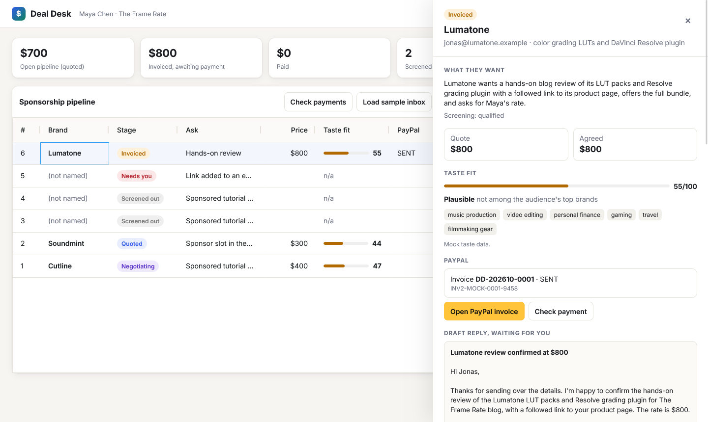

# Deal Desk

An agent that runs the sponsorship inbox for independent creators: it screens inbound brand email, quotes from your rate card, negotiates inside rules you set, sends a PayPal invoice the moment a brand agrees in writing, and confirms payment with PayPal before anything is published.

The AI reads and writes. The code decides. Claude reads every email and drafts every reply, but prices, floors, concessions and the decision to invoice live in plain Python that the model cannot talk its way around.



## The problem, measured

This was built from four months of running a real sponsorship inbox for a small publishing business: **94 inbound sponsor threads across 2,957 processed emails**.

- **7 closed**, at $125 to $350 each. The money is real and so is the volume of noise around it.
- **45 went cold** after a quote, **15 were declined**, **8 bounced**. Most of the inbox is resellers, mass-sent "Dear Webmaster" templates and agencies that will not name their client.
- **Every deal billed with a real PayPal invoice was paid: 3 of 3.** The one billed by pasting a PayPal address into an email was not: 0 of 1. Brands send invoices to accounts payable, so a pasted address asks a marketer to do a bank transfer by hand.

So the slow part of a sponsorship is not finding the brand. It is the hours of triage, the haggling, and the gap between "yes" and a bill a finance team can pay. Deal Desk closes that gap.

## What it does

```
inbound email
  -> Claude reads it         (who is this, what do they want, what did they offer)
  -> code screens it         (blocked categories, link brokers, mass-sent templates, unnamed agency clients)
  -> Qloo scores taste fit   (does this brand fit what your audience actually loves)
  -> code prices it          (rate card, followed-link surcharge)
  -> Claude drafts a reply   (checked by code: any dollar amount it was not given blocks the draft)
reply from the brand
  -> Claude reads the position (accepts / counters $X / asks / declines)
  -> code picks the move       (one concession of one step, never below the floor)
  -> written agreement at or above the floor -> PayPal invoice, created and sent automatically
INVOICING.INVOICE.PAID webhook (or polling)
  -> code re-reads the invoice from PayPal and only then marks it paid
  -> fulfilment, live URL, receipt
```

Every step is written to the deal's timeline, so the drawer in the UI is an audit trail of what the agent did and why.

## The guardrails that make it safe to let an agent send invoices

| Rail | Where | Test |
|---|---|---|
| Never invoice below the floor | `policy.may_invoice` | `test_accept_below_floor_never_invoices` |
| At most one concession, one step | `policy.next_move` | `test_one_step_concession_never_below_floor` |
| A draft that names any unauthorised dollar amount cannot be sent; one automatic retry with the problem fed back | `llm.check_draft`, `desk._draft` | `test_bad_draft_is_retried_with_feedback`, `test_persistently_bad_draft_cannot_be_approved` |
| A "paid" webhook is never trusted on its own; the invoice is re-read from PayPal | `desk.mark_paid` | `test_forged_paid_webhook_is_not_trusted` |
| Webhook signatures verified with PayPal's verify-webhook-signature API | `PayPalClient.verify_webhook` | |
| Claude's guesses about template mail are shown but never screen out a brand on their own | `policy.screen` | `test_model_template_guesses_alone_never_screen_out_a_brand` |
| Mock taste data never reaches a counterparty's inbox | `desk._facts` | `test_mock_taste_never_reaches_a_counterparty` |

The last two came from live runs, not from planning. On one run Claude flagged "Hello," as evidence of a template and the screen threw out a paying brand. On another, a draft told a brand about its audience's tastes using placeholder data.

## PayPal

Deal Desk uses the **Invoicing v2 API** in the PayPal sandbox: OAuth client credentials, create draft, send, read status, record payment, and `INVOICING.INVOICE.PAID` webhooks verified through `/v1/notifications/verify-webhook-signature`. See `dealdesk/paypal.py`.

An invoice, rather than a checkout button, because the payer here is a business. It goes to an accounts payable address, it carries an invoice number and a line item a finance team can file, and it can be paid by PayPal balance or card.

## Qloo

Creators know what their audience loves, not the demographic segments brands buy on. Deal Desk takes a handful of seeds (tools, films, channels the audience talks about) and uses Qloo's Taste AI to:

- **score inbound fit**: cosine similarity between the audience's tag affinities and the brand's, plus whether the brand ranks among the audience's own top brands, explained by the shared tags;
- **find outbound prospects**: brands this audience over-indexes on that have never written in.

See `dealdesk/taste.py`.

## Run it

```bash
python -m venv .venv && .venv/Scripts/activate      # or source .venv/bin/activate
pip install -r requirements.txt
export ANTHROPIC_API_KEY=sk-ant-...
python -m dealdesk                                   # http://127.0.0.1:8040
```

Click **Load sample inbox** to run the agent on six synthetic emails: a direct brand, a newsletter booking with a low budget, a "Dear Webmaster" blast, a casino, an agency hiding its client, and a review request that wants a followed link.

Without PayPal or Qloo keys the app runs against in-memory stand-ins and says so in the header. To use the real APIs, copy `config/config.example.json` to `config/config.json`, add PayPal sandbox credentials and a Qloo key, then confirm both with:

```bash
python -m dealdesk.verify
```

Your own rate card goes in `config/policy.json` (start from `config/policy.example.json`).

## The public demo

The hosted version runs in replay mode (`index.py`). Every sample email and every one-click reply in the drawer was recorded once through the live model (`scripts/record_cassette.py`), so those paths are instant and free. Anything new, such as an email you paste yourself, goes to the live model under a small daily cap, and past the cap the API answers 429 with a plain message instead of spending.

## Tests

```bash
python -m pytest -q
```

32 tests cover the negotiation ladder, the invoice gate, screening, the draft guard, the full quote-to-delivered path, webhook parsing, the PayPal request bodies, the taste maths, the HTTP API, and the public demo's spending cap. The safety tests were checked by deliberately breaking the floor check and the payment re-read and confirming the suite fails.

`scripts_eval.py` runs the samples through the live model several times and reports agreement with the expected outcome.

## Stack

Python, FastAPI, SQLite, Claude (`claude-opus-5-5`, structured outputs), PayPal Invoicing v2, Qloo Taste AI, AG Grid Community for the pipeline board.

## Credits

Built by Noah Albert with Claude Code. The business rules, numbers and failure cases come from running the sponsorship inbox it is modelled on.

## License

MIT
